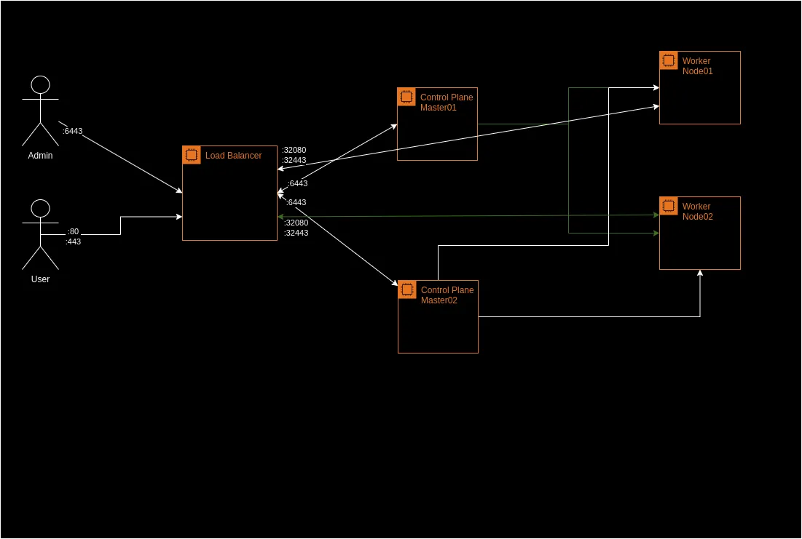
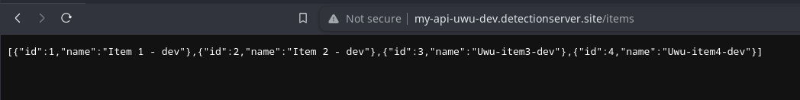
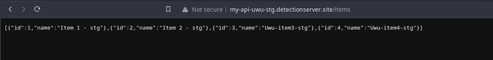
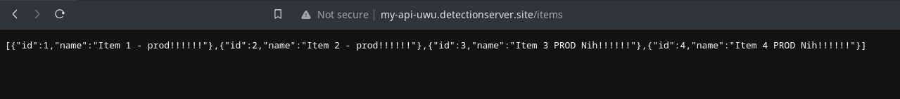
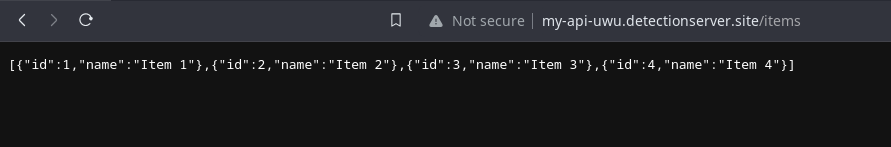

# My Uwu Application
This repository contain 2 application that build with golang(1.21) and nodejs(18).
1. My-api-uwu:
    * Dev Env: http://my-api-uwu-dev.detectionserver.site/items
    * Stag Env: http://my-api-uwu-stg.detectionserver.site/items
    * Prod Env: http://my-api-uwu.detectionserver.site/items
2. My-spa-uwu:
    * Dev Env: http://my-spa-uwu.detectionserver.site
    * Stag Env: http://my-spa-uwu-stg.detectionserver.site
    * Prod Env: http://my-spa-uwu-prod.detectionserver.site

### Tools
1. Kubernetes: 1.28.4
2. Terraform: 1.5.0
3. Helm: 3.11
4. Ansible: core2.15.8
5. Kubespray
6. Github Action
7. Github Private Registry
8. Sonarqube Community
9. Trivy
10. Pre-commit

## Architecture
For the architecture, I employ a Kubernetes cluster comprising two master nodes for high availability and redundancy, along with two worker nodes to handle application workloads. To ensure proper load distribution and accessibility, an external load balancer is configured. This load balancer serves the critical function of directing traffic both to the kube-api-server, ensuring efficient communication within the Kubernetes cluster, and managing incoming HTTP and HTTPS traffic for applications running on the cluster. This setup not only enhances the resilience of the Kubernetes control plane but also optimizes the distribution of external user traffic across the worker nodes.


## Pipeline phase
I implement GitHub Actions for a streamlined CI/CD approach, organized into three essential pipelines. The pull request pipeline provides swift feedback for developers, ensuring quick insights into the impact of their changes. The main branch pipeline focuses on deploying a resilient application to production, while a dedicated rollback pipeline efficiently addresses unforeseen issues. The use of filters optimizes the process by triggering changes only when modifications occur in specific directories or services, enhancing precision and resource efficiency throughout the CI/CD lifecycle. Also we need to protect the main branch to only get new changes from Pull Request, and will reject a direct commit.
1. Main branch pipeline.
* Purpose: End-to-end deployment of the application to production.
* Steps:
 - Build the application.
 - Dockerize the application.
 - Deploy the application.

2. Pull request pipeline
* Purpose: Validate changes before merging into the main branch.
* Checks:
  - Test build
  - Linting to ensure code style and best practices.
  - Unit tests for functional validation.
  - Test build for Docker image.
  - Static Code Analytics.
  - Security check for Docker image vulnerabilities.

3. Rollback pipeline
* Purpose: Rollback the application into the specific version.

## Deployment phase
The deployment process follows a structured workflow designed to ensure consistency and reliability across different environments. It initiates automatically upon code push to the main branch, with changes progressively promoted through dev, staging, and production environments.
* Deployment Workflow with Environment Promotion:
  - Artifact/Docker Image Use: Same artifact/Docker image is used across all environments for consistency.
  - Trigger: Deployment only happens when code is pushed to the main branch.
  - Dev Environment: Automatic deployment to the dev environment on main branch push.
  - Testing in Dev: Tests and checks in the dev environment to validate changes.
  - Staging Promotion: Manual promotion of changes to staging after successful testing in dev.
  - Testing in Staging: Additional checks and testing in the staging environment.
  - Production Promotion: Promotion to the production environment is automated upon the creation of a git tag, signifying the completion of testing and approval in the staging environment.
  - Consistent Artifacts: Same artifact/Docker image used in all environments prevents issues.

* In the deployment process, a rolling update approach is adopted to ensure seamless transitions. Helm charts serve as a fundamental tool to manage deployments. A base chart, accommodating both Go and Node applications, is created to streamline maintenance, with the primary differentiator being the values files. While distinct values files are maintained for each environment, a singular general values file promotes consistency and simplifies overall management. The choice of distroless as the base image for runtime applications aligns with security best practices, aiming to reduce the attack surface. Applications run within containers under a non-root user, contributing to an additional layer of security. To orchestrate deployments, a dedicated deployer user is created. This user is assigned the responsibility of handling deployments to the Kubernetes cluster, enhancing security by segregating deployment tasks from other user roles.
    * My Api Uwu on Dev Environment
    
    * My Api Uwu on Stg Environment
    
    * My Api Uwu on Prod Environment
    
    * My Api Uwu on Prod Environment - Rollback
    

## Rollback and versioning
The version is automatically generated based on the commit SHA short for each change in the main branch but in prod use git tag with semver. Rollback can be manually triggered, requiring the definition of a variable for specifying the rollback version.

## Infrastructure Provisioning Plan
The infrastructure provisioning process employs Terraform as the Infrastructure as Code (IaC) tool. Initially, virtual machines are provisioned in Proxmox using Terraform. Subsequently, [Kubespray](https://github.com/kubernetes-sigs/kubespray) is utilized, leveraging Ansible, to efficiently provision the Kubernetes cluster on the provisioned virtual machines. This two-step approach ensures a structured and automated setup of the infrastructure.
* Directory structure.
```bash
$ tree infra
.
├── ansible
│   └── kube-playground
│       ├── credentials
│       ├── group_vars
│       │   ├── all
│       │   │   ├── all.yml
│       │   │   ├── containerd.yml
│       │   │   ├── coreos.yml
│       │   │   ├── cri-o.yml
│       │   │   ├── docker.yml
│       │   │   ├── etcd.yml
│       │   │   ├── gcp.yml
│       │   │   ├── hcloud.yml
│       │   │   ├── huaweicloud.yml
│       │   │   ├── oci.yml
│       │   │   ├── offline.yml
│       │   │   ├── openstack.yml
│       │   │   ├── upcloud.yml
│       │   │   └── vsphere.yml
│       │   ├── etcd.yml
│       │   └── k8s_cluster
│       │       ├── addons.yml
│       │       ├── k8s-cluster.yml
│       │       ├── k8s-net-calico.yml
│       │       ├── k8s-net-cilium.yml
│       │       ├── k8s-net-custom-cni.yml
│       │       ├── k8s-net-flannel.yml
│       │       ├── k8s-net-kube-ovn.yml
│       │       ├── k8s-net-kube-router.yml
│       │       ├── k8s-net-macvlan.yml
│       │       └── k8s-net-weave.yml
│       ├── hosts.yaml
│       ├── inventory.ini
│       └── patches
│           ├── kube-controller-manager+merge.yaml
│           └── kube-scheduler+merge.yaml
├── kube
│   ├── base
│   │   ├── charts
│   │   ├── Chart.yaml
│   │   ├── templates
│   │   │   ├── deployment.yaml
│   │   │   ├── _helpers.tpl
│   │   │   ├── hpa.yaml
│   │   │   ├── ingress.yaml
│   │   │   ├── NOTES.txt
│   │   │   ├── serviceaccount.yaml
│   │   │   └── service.yaml
│   │   └── values.yaml
│   └── misc
│       ├── deployer-access.yaml
│       └── dockerconfigjson.yaml
└── tf
    ├── main.tf
    ├── outputs.tf
    └── provider.tf
```

## Future Plan
Here are some future plans, but still depend on the urgency and need.
1. Infrastructure Provisioning Repository
-> Opting for a dedicated repository for infrastructure provisioning, with the flexibility to adopt a project-based infrastructure provisioning approach. This separation helps manage infrastructure changes independently from application code.
2. Deployment Strategies
-> Implementing advanced deployment strategies such as blue-green and canary deployment, tailored to specific needs. These strategies enhance deployment safety, minimize downtime, and allow for controlled rollouts.
3. Observability with Tracing/APM
-> Integrating tracing and application performance monitoring (APM) using technologies like OpenTelemetry. This addition provides comprehensive observability into the application's behavior, aiding in debugging, performance optimization, and overall system health monitoring.
4. SSL Certs
-> Use cert-manager to manage the ssl certificate.
